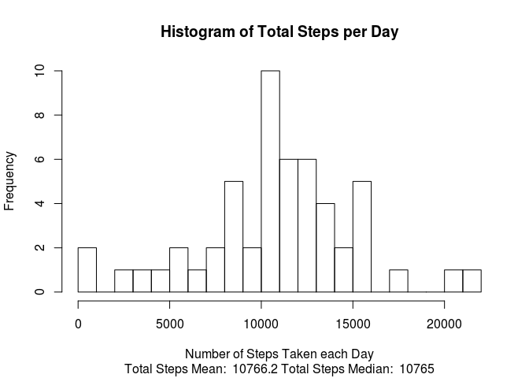
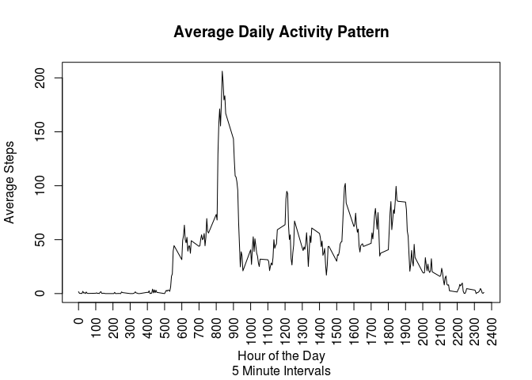
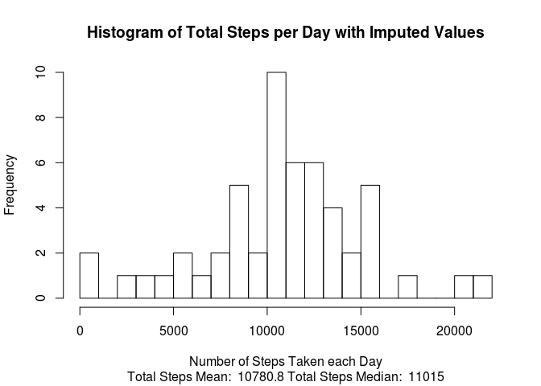
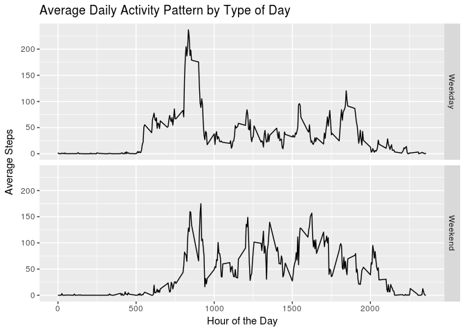

# Reproducible Research: Peer Assignment 1
michael.coursera@eipsoftware.com  
October 10, 2017  
[Github Repository](https://github.com/mmooney512/RepData_PeerAssessment1)


## Loading Required R Libraries 


```r
library(dplyr)
library(lubridate)
library(ggplot2)
```
***


## Read the Data Set

```r
# set working directory to local directory
# setwd("~/Documents/coursera/course5_repro_research")
data_activity <- read.table("activity.csv", header = TRUE, sep=",")
```


## Preprocess the Data Set
1. convert the date column to date type
2. Add a column to signify what day of the week it is. Using the label 
argument it will put name of the day in the field. (Monday, Tuesday, etc..)


```r
data_activity$date <- as.Date(data_activity$date)

data_activity$Weekday <- wday(data_activity$date, label = TRUE, abbr = FALSE)
```


## Data Analysis - Part One

### Daily Activity?
a. What is mean total number of steps taken per day?
b. Make a histogram of the total number of steps taken each day
c. Calculate and report the mean and median of the total number of steps taken
per day


Sum the number of steps by each day

```r
daily_summary <- data_activity %>% 
				group_by(date) %>% 
				summarise(steps = sum(steps))
```


Calculate the mean and median

```r
#Part One - a
daily_summary_mean 		<- mean(daily_summary$steps, na.rm = TRUE)
daily_summary_median	<- median(daily_summary$steps, na.rm = TRUE)
```


Plot the histogram of the daily count

```r
#Part One - b
#part One - c
hist(daily_summary$steps
	 ,main = "Histogram of Total Steps per Day" 
	 ,xlab = "Number of Steps Taken each Day"
	 ,breaks = 20
	 ,sub = paste("Total Steps Mean: ", round(daily_summary_mean,1)
	 			 ,"Total Steps Median: ", round(daily_summary_median,1)
	 			 )
	 )
```

<!-- -->


***


## Data Analysis - Part Two 

### What is the average daily activity pattern?

a. Make a time series plot of the 5-minute interval and the average number 
of steps taken, averaged across all days
b. Which 5-minute interval, on average across all the days in the data set, 
contains the maximum number of steps?


Summarize by hour and 5-minute increments

```r
hourly_summary <- 	data_activity %>% 
					group_by(interval) %>% 
					summarise(steps = mean(steps, na.rm=TRUE))
```


Graph of average number of steps taken, averaged across all days

```r
#Part Two - a
with(hourly_summary,
		plot(interval
			 ,steps
			 ,type = "l"
			 ,main = "Average Daily Activity Pattern"
			 ,xlab = "Hour of the Day"
			 ,sub  = "5 Minute Intervals"
			 ,ylab = "Average Steps"
			 ,xaxt = 'n'
			 )
	)
axis (1, at=seq(0,2400,by=100),las = 2)
```

<!-- -->


Extract which 5 min interval has highest average

```r
#Part Two - b
hourly_summary_max <- hourly_summary[which.max(hourly_summary$steps),]
```

The 5 minute interval with the maximum number
of steps is 835
with 206.2


***


## Data Analysis - Part Three 
### Imputing Missing Values

a. The total number of missing values in the data set?
b. Strategy for filling in all of the missing values in the data set.
c. Revised data set with imputed values
d. Calculate and report the mean and median total number of steps taken per day
e. Histogram of the total number of steps taken each day.
f. Difference from the estimates from the part one? 
g. What is the impact of imputing missing data on the estimates of 
the total daily number of steps?


```r
# Part Three - a
# count NA values
missing_values <- sum(is.na(data_activity$steps))
```
The total number of missing values in the data set is 2304


**Strategy for imputing the missing values**

1. I will copy the data_activity into a new data frame called
data_activity_imputed.  
2. Create a new average, weekday_hourly_summary that is grouped by day of week
and five minute increment
3. I will replace the missing values by the average of the day of the week and
in that five minute increment. 
	+ However if the average is < 10 steps in the five minute increment I will 
replace with a value of 0.  
	+ The reason is to reduce noise in the imputed values. 
	+ The imputed value of steps is rounded to an integer value


**Copy the data_activity**

```r
#Part 3 - b.1
data_activity_imputed <- data_activity
```


**Summarize by hour and 5-minute increments**


```r
#Part 3 - b.2
weekday_hourly_summary <- 	data_activity %>% 
							group_by(Weekday, interval) %>% 
							summarise(steps_avg = mean(steps, na.rm=TRUE))
```


**Replace missing values by weekday and 5 minute increment**

*if the value is NA replace with the average value*


```r
#Part 3 - b.3
data_activity_imputed <- merge(data_activity_imputed
							   ,weekday_hourly_summary
							   ,by=c("Weekday","interval"))


data_activity_imputed$steps <- if_else(is.na(data_activity_imputed$steps) 
									   & data_activity_imputed$steps_avg < 10
									   ,as.integer(0)
									   ,data_activity_imputed$steps)


data_activity_imputed$steps <- if_else(is.na(data_activity_imputed$steps) 
									   ,as.integer(data_activity_imputed$steps_avg)
									   ,data_activity_imputed$steps)
```


** Summarize the number of steps by each day with imputed values **


```r
#Part 3 - d_1
daily_summary_imputed <- data_activity_imputed %>% 
						group_by(date) %>% 
						summarise(steps = sum(steps))
```


**Calculate the mean and median with imputed values**


```r
#Part 3 - d_2
daily_imputed_mean 		<- mean(daily_summary_imputed$steps, na.rm = TRUE)
daily_imputed_median	<- median(daily_summary_imputed$steps, na.rm = TRUE)
```


** Histogram of the total number of steps taken each day. **


```r
#Part 3 - e
hist(daily_summary$steps
	 ,main = "Histogram of Total Steps per Day with Imputed Values" 
	 ,xlab = "Number of Steps Taken each Day"
	 ,breaks = 20
	 ,sub = paste("Total Steps Mean: ", round(daily_imputed_mean,1)
	 			 ,"Total Steps Median: ", round(daily_imputed_median,1)
	 			 )
	 )
```

<!-- -->


**The differences between estimated and imputed values:**

Mean: 	0.1%

Median:	2.3%


** What is the impact of imputting missing data on the estimates of the total daily number of steps?**

There is minimal impact. The change in the mean was ~ 1/10%

The change in the median was ~ 2.3% which I think is below the level of significance.


***


## Data Analysis - Part Four
### Are there differences in activity patterns between weekdays and weekends?

a. Create a new factor variable in the data set with two levels – “weekday” and “weekend” indicating whether a given date is a weekday or weekend day.
b. Make a panel plot containing a time series plot of the 5-minute interval and the average number of steps taken, averaged across all weekday days or weekend days.


Add a column to the data frame indicating if the day of the week is a weekday or weekend

```r
#Part 4 - a
data_activity_imputed <- data_activity_imputed %>%
						mutate(Weekend = if_else(Weekday %in% c("Sunday", "Saturday")
												 ,"Weekend" 
												 , "Weekday"))
```


Plot showing the difference between weekdays and weekends

```r
# Part 4 - b
# Summarise the data by weekday or weekends and 5-minute increments
hourly_summary_imputed <- 	data_activity_imputed %>% 
							group_by(Weekend, interval) %>% 
							summarise(steps = mean(steps, na.rm=TRUE))

# plot the data
ggplot(hourly_summary_imputed, aes(x=interval,y=steps)) +
	geom_line () +
	facet_grid(Weekend ~ .) +
    xlab("Hour of the Day") +
    ylab("Average Steps") +
	ggtitle("Average Daily Activity Pattern by Type of Day")
```

<!-- -->


```r
#Part - 4.b 
avg_steps <- aggregate(hourly_summary_imputed[,3],list(hourly_summary_imputed$Weekend), sum)
```

The plots show that on average the there is a difference in time of day of the activity.
The weekends are showing higher average activity per hour.  Even though the weekday 
activity has a spike in the morning hours.  

Average steps per weekday: 10.2 thousand

Average steps per weekend: 12.4 thousand

Weekend steps are: 21.2 % higher.

---
